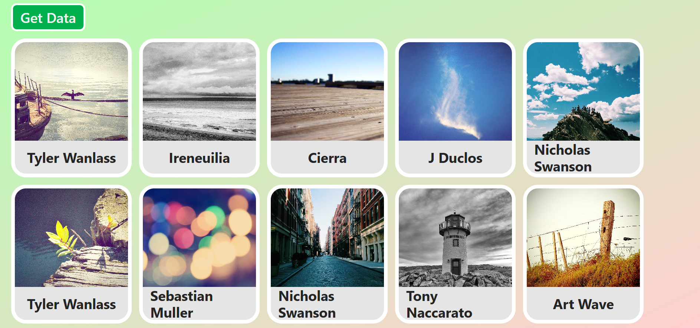
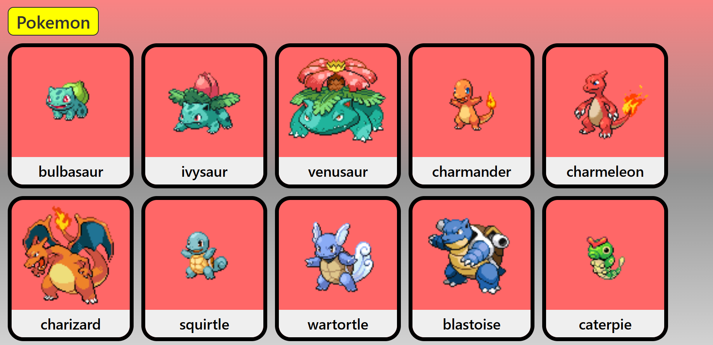

# Axios Image Cards App

A simple React app that fetches images using **Axios** and displays them as cards.

<p align="center">
  
  
</p>

## Features
- Fetch images from API
- Axios for HTTP requests
- Card-based UI
- Responsive layout

## Tech Stack
- React
- Axios
- Tailwind CSS

## API Used
- https://picsum.photos/v2/list

## Run Locally
```bash
npm install
npm run dev