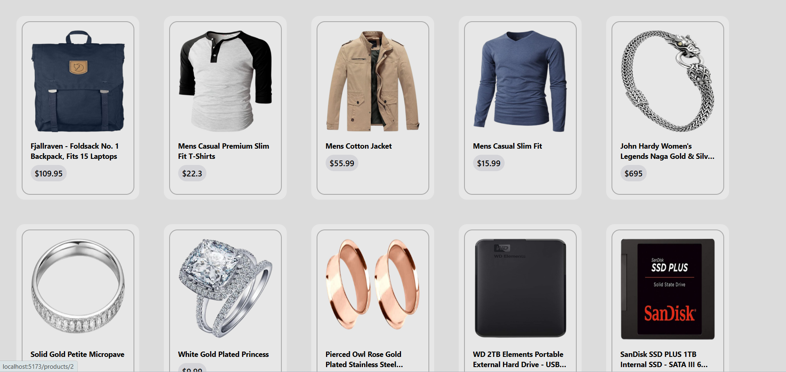
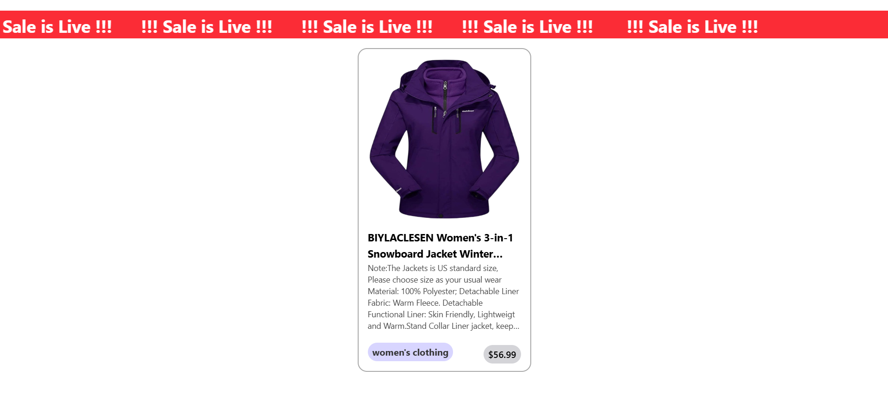

# React Product Store 🛍️

A React-based product store application that fetches product data from an external API, manages it globally using Context API, and provides smooth navigation between product listings and detailed views.

---

## 🔍 Preview

<p align="center">
  
</p>

<p align="center">
  
</p>

<p align="center">
  
</p>

---

## ✨ Features
- Product data fetched from FakeStore API
- Global state management using Context API
- Product listing page
- Individual product detail page with dynamic routing
- Loading state handling
- Smooth navigation using React Router
- Clean and modular component structure

---

## 🧠 Concepts Covered
- React Hooks (`useState`, `useEffect`, `useContext`)
- Context API for global state
- React Router (`Routes`, `Route`, `useParams`, `useNavigate`)
- API layer separation
- Conditional rendering
- React render & re-render behavior
---

## 📁 Project Structure
src/
├── api/
│ └── ProductApi.js
├── context/
│ └── ProductContext.jsx
├── pages/
│ ├── Home.jsx
│ ├── AllProducts.jsx
│ └── SelectedProduct.jsx
├── App.jsx
└── main.jsx

public/
├── preview1.png
├── preview2.png
└── preview3.png

---

## 🔄 Application Flow
1. Products are fetched once inside `ProductContext`
2. Data is stored globally using Context API
3. Pages consume product data via `useContext`
4. Product details are rendered using route parameters

---

## 🌐 API Used
- https://fakestoreapi.com/products

---

## ▶️ Run Locally
```bash
npm install
npm run dev
📝 Note
This project is built to understand and practice real-world React concepts such as rendering behavior, global state management, and routing.
