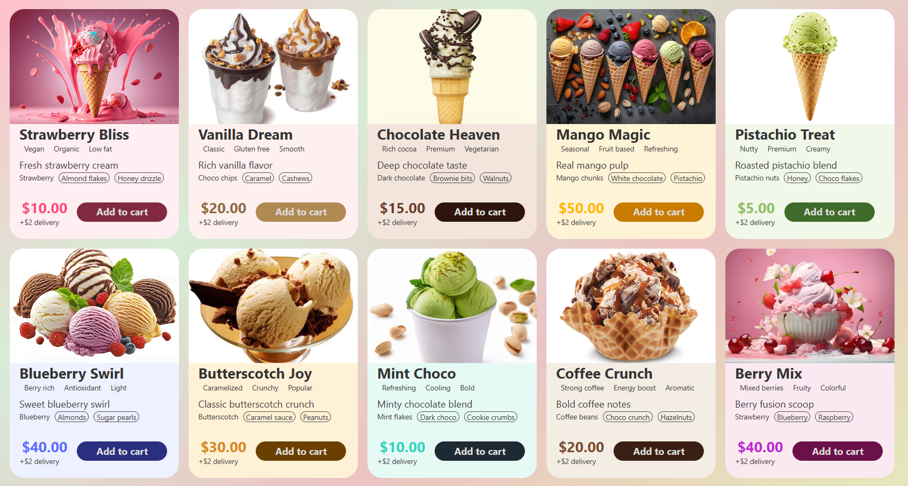

# 🍨 Ice Cream Cards UI

A modern, minimal ice-cream card UI built with **React** and **Tailwind CSS**.  
Clean layout, smooth background, and reusable card components.

## 🍨 UI Preview

  

## ✨ Features
- Responsive card design
- Dynamic data using array of objects
- Clean pastel UI background
- Text truncation with ellipsis
- Easy to extend & customize

## 🛠 Tech Stack
- React
- Tailwind CSS

## 📦 Usage
- Map over the iceCreams array
- Pass data as props to Card component
- Customize styles via Tailwind classes

## 🎯 Perfect For
- UI practice
- Product cards
- Portfolio projects

---

Developed by Sonu Kumhar