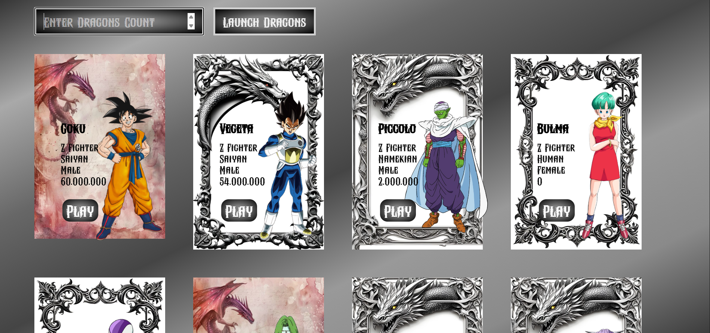

# 🐉 Dragon Ball Cards (React + Tailwind)

A dynamic Dragon Ball character showcase built with **React**, **Axios**, and **Tailwind CSS**.  
Users can choose how many characters to load, and cards appear with **3D tilt effects**, **animated GIFs**, and a **dark UI**.

<p align="center">
  
</p>

---

## ✨ Features
- Fetch characters from **Dragon Ball API**
- User-controlled character count
- 3D card tilt with straight character image
- Animated marquee GIFs
- Dark theme UI
- Custom scrollbar styling

---

## 🛠 Tech Stack
- React
- Axios
- Tailwind CSS

---

## 🚀 Run Locally

```bash
npm install
npm run dev
